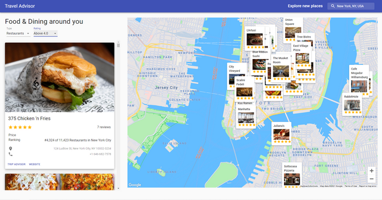

# Travel Advisor

Date: 2018



## Introduction
A Travel Companion Application using Google Maps. With 
* Geolocation
* Google Maps API
* Searching for places
* Fetching restaurants
* hotels 
* attractions based on location from specialized Rapid APIs
* data filtering

## APIs

[RapidAPI](https://rapidapi.com/hub)

[Travel Advisor API](https://rapidapi.com/apidojo/api/travel-advisor)

[Open Weather Map API](https://rapidapi.com/community/api/open-weather-map)

## Setup: 

run ```npm i && npm start``` to start the development server
